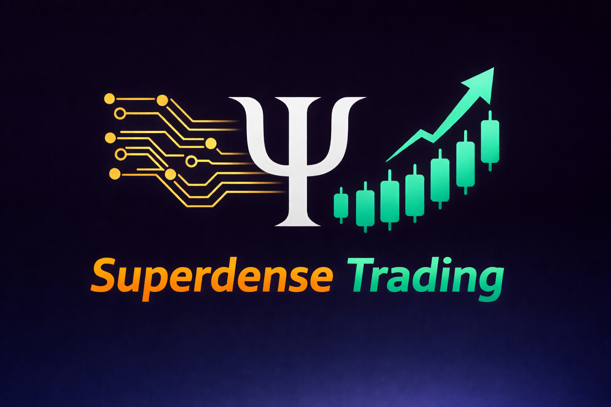

  

<h1 align="center">Superdense Trading</h1>

  <b>Quantitative Trading • Market Analysis • Algorithmic Strategies • Quantum Advantage • Portfolio Optimization</b>

  
  
  
  

# Superdense Trading

Vision: A revolutionary trading simulator harnessing quantum computing for superior portfolio optimization and risk analysis, built with a hybrid Python-Rust architecture.

Core Innovation: Integrates quantum algorithms (QEA, QAE, QML via Qiskit) directly into classical trading workflows. Demonstrates practical quantum advantage in finance through portfolio optimization, risk modeling, and predictive analytics.

Technical Architecture: Employs a hybrid stack: Python for rapid development, quantum integration, and UI; Rust for high-performance order matching and data processing. This ensures both development velocity and execution speed.

## Key Features:

• Quantum-enhanced portfolio optimization (QAOA/VQE)

• Quantum amplitude estimation for risk analysis

• Hybrid backtesting engine with classical/quantum strategies

• Real-time market data integration

• Professional visualization dashboard

## Educational Impact: 

• Provides an accessible platform for learning quantum finance, bridging theoretical algorithms and practical trading applications.

• Standout Factor: Production-ready quantum trading simulator demonstrating measurable performance improvements over classical methods.

• Target: Aspiring quants, quantum computing students, and financial researchers seeking cutting-edge tools.

• Status: Actively developed with roadmap for quantum hardware integration and advanced algorithm implementation.
